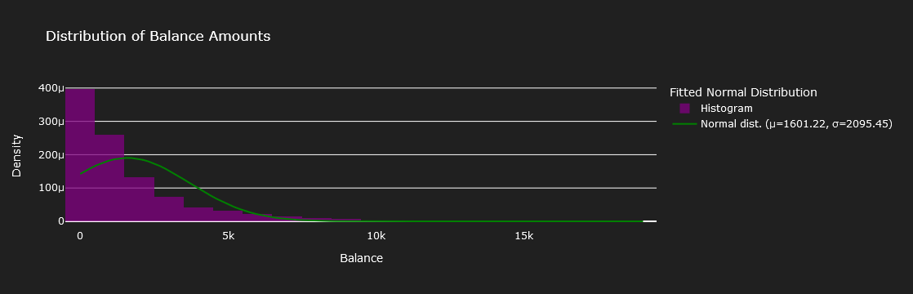
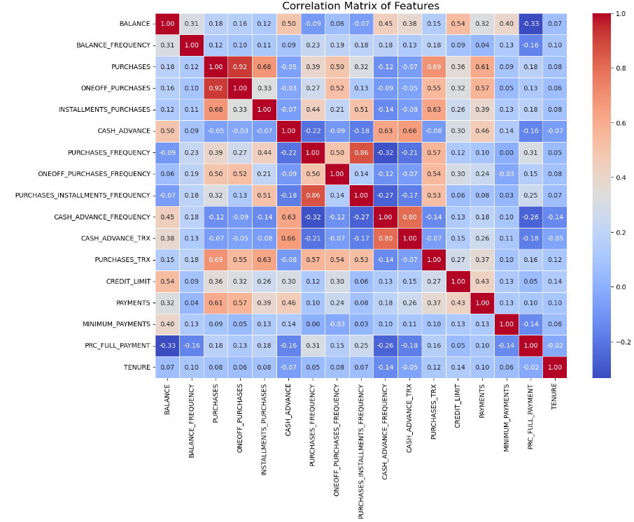
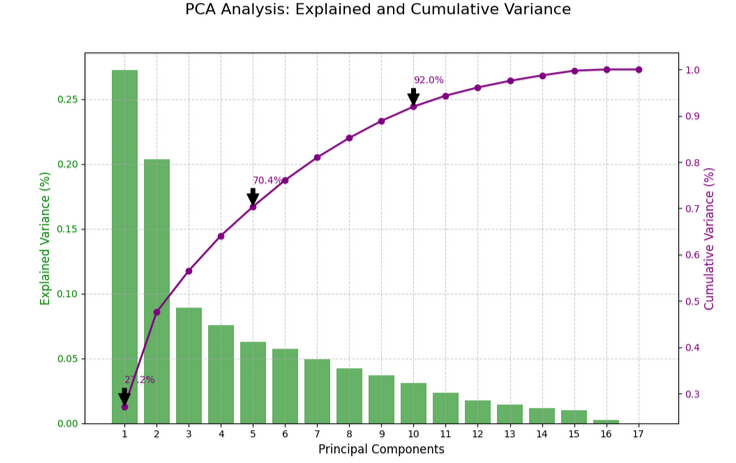
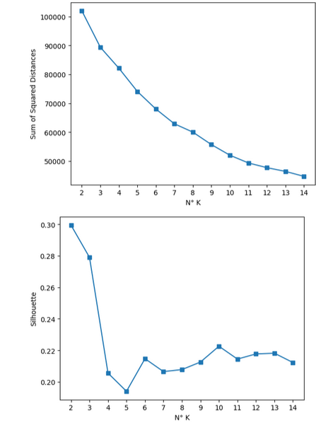
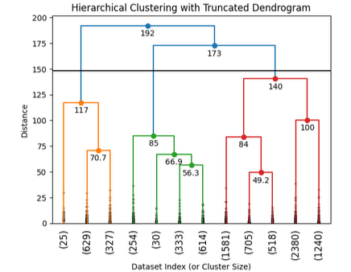
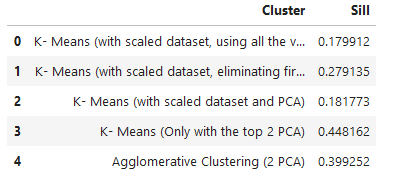

# Customer-Segmentation: Analyzing Behavior of Credit Card Users for Targeted Marketing
---

- **Objective**: Develop a customer segmentation model for approximately 9,000 active credit card holders based on their behavioral patterns over the last six months.
- **Analysis**: Examine 18 key variables, including spending habits, payment behavior, and credit usage, to identify distinct customer segments.
- **Models** : 5 models developed comprising K-Means and Agglomerative Clustering
- **Impact**: Use segmentation insights to optimize targeted marketing strategies, improve customer understanding, enhance satisfaction, and drive business growth.

## Resources Used

**Python Version**: 3.12.1

**Packages**: pandas,numpy,sklearn,matplotlib,seaborn,scipy,plotly,IPython.display

**Dataset**: https://www.kaggle.com/datasets/arjunbhasin2013/ccdata

## Data Cleaning

- The Dataset was pretty clean it was only necessary to dropped 313 rows that had null values. (3,5% of the total rows)

## EDA

Many different graphs were made to understand the dataset better. Below some of them. 

## Model Building

The data was scaled, and for some models also PCA was used. The data was not split into test and train because the models are unsupervised.
5 diferent models were conducted and evaluated using the Silhouette Score.

- K- Means (with scaled dataset, using all the variables)
- K- Means (with scaled dataset, eliminating first variables that are highly correlated)
- K- Means (with scaled dataset and PCA)
- K- Means (Only with the top 2 PCA)
- 

In these four previous models, to determine the right number of clusters, the elbow method was used.

- Agglomerative Clustering (2 PCA)

For this last model, the dendogram was used.

## Model Performance

The K-Means (Only with the top 2PCA) outperformed the other ones.

